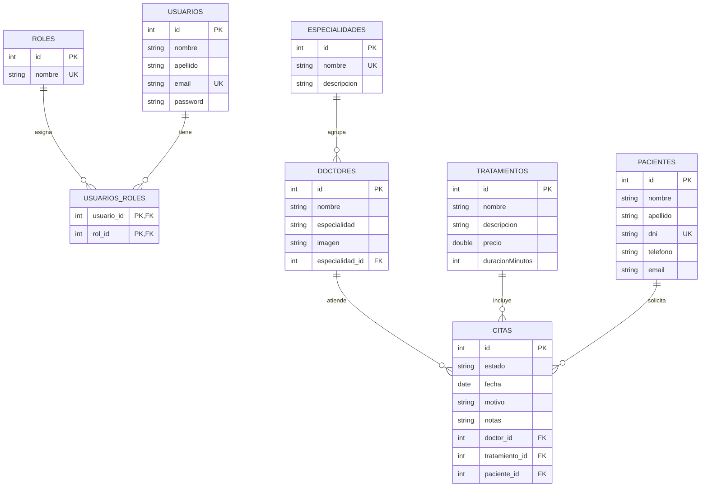

# PLAN DE DESARROLLO DE SOFTWARE (VERSIÓN INICIAL)

---

## 🦷 PROYECTO: TuDentaria - Sistema de Gestión Odontológica y Reservas Clínicas

* **Institución:** Universidad Tecnológica del Perú (UTP)
* **Curso:** Desarrollo Web Integrado / Programación Web
* **Framework Principal:** Spring Boot 3.3.5 (Java 17)
* **Base de Datos:** MySQL / H2
* **Fecha:** Septiembre 2026

---

## 1. INTRODUCCIÓN Y DESCRIPCIÓN DEL PROYECTO

**TuDentaria** es una plataforma web integral orientada al sector de salud odontológica, diseñada para automatizar y optimizar la gestión de atenciones dentales, administración de personal médico especializado, catálogo de tratamientos y reservas de citas en tiempo real. 

El sistema cuenta con una arquitectura desacoplada en capas (Modelo, Repositorio, Servicio, Controlador MVC y Controlador REST), proporcionando tanto una interfaz web amigable y responsiva para pacientes y administradores como una API RESTful abierta para la interoperabilidad con aplicaciones móviles y servicios externos.

---

## 2. OBJETIVOS DEL PROYECTO

### 2.1. Objetivo General
Diseñar e implementar un sistema web seguro, escalable y mantenible para la administración clínica y reserva de citas odontológicas, aplicando las mejores prácticas de ingeniería de software con Spring Boot, Spring Data JPA, Spring Security y metodología TDD (Test-Driven Development).

### 2.2. Objetivos Específicos
1. **Modelado Relacional Completo:** Diseñar una base de datos relacional con al menos 6 tablas relacionadas que cubran usuarios, roles, doctores, especialidades, tratamientos, citas y pacientes.
2. **Arquitectura en Capas:** Implementar interfaces de persistencia con Spring Data JPA y una capa de servicios de negocio transaccionales.
3. **API RESTful CRUD:** Exponer endpoints REST bajo el estándar HTTP (`GET`, `POST`, `PUT`, `DELETE`) para el mantenimiento de entidades del sistema, con validación de datos y respuestas JSON formateadas.
4. **Seguridad y Control de Acceso:** Configurar Spring Security con encriptación BCrypt, autenticación por formulario y autorización basada en roles (`ROLE_ADMIN`, `ROLE_USER`).
5. **Calidad y Pruebas Unitarias TDD:** Asegurar la robustez del código mediante pruebas unitarias y de integración para repositorios, servicios y controladores.

---

## 3. ALCANCE INICIAL DEL SISTEMA

El sistema inicial abarca los siguientes módulos operativos:

| Módulo | Descripción |
|---|---|
| **Portal Público** | Página de inicio interactiva, información institucional, catálogo de servicios, equipo médico y formulario web de solicitud de citas. |
| **Seguridad y Usuarios** | Registro de nuevos usuarios, inicio de sesión seguro, encriptación de credenciales y asignación de roles. |
| **Panel Administrativo (Backoffice)** | Dashboard con métricas de citas, gestión de catálogo de doctores (creación, edición, carga de fotos, eliminación) y control de estados de citas. |
| **API RESTful (`/api/**`)** | Endpoints de servicios web para consumo por clientes REST (Postman, aplicaciones móviles, frontends SPA). |

---

## 4. STACK TECNOLÓGICO Y ARQUITECTURA

* **Lenguaje:** Java 17 LTS
* **Framework Backend:** Spring Boot 3.3.5
  * *Spring Web* (MVC y REST)
  * *Spring Data JPA* (Persistencia ORM con Hibernate)
  * *Spring Security 6* (Autenticación y Autorización)
  * *Spring Boot Validation* (Validación de Bean Validation / Jakarta)
* **Frontend:** Thymeleaf, HTML5, CSS3 moderno, Bootstrap 5, JavaScript
* **Base de Datos:** MySQL 8.x (Producción) / H2 in-memory (Pruebas unitarias)
* **Pruebas (TDD):** JUnit 5, Mockito, Spring Test (MockMvc), DataJpaTest
* **Gestor de Dependencias y Construcción:** Apache Maven

---

## 5. MODELO DE DATOS Y DIAGRAMA ENTIDAD-RELACIÓN (7 TABLAS)

El sistema cuenta con un modelado relacional que supera el requisito mínimo de 6 tablas:



---

## 6. ESPECIFICACIÓN Y EVIDENCIAS DE LA API REST (CRUD DOCTORES)

La API REST se encuentra montada bajo la ruta `/api/doctores`.

### 6.1. Resumen de Endpoints

| Método | Endpoint | Descripción | Código Éxito |
|:---:|---|---|:---:|
| `GET` | `/api/doctores` | Listar todos los doctores registrados | `200 OK` |
| `GET` | `/api/doctores/{id}` | Obtener el detalle de un doctor por su ID | `200 OK` |
| `POST` | `/api/doctores` | Registrar un nuevo doctor | `201 CREATED` |
| `PUT` | `/api/doctores/{id}` | Actualizar datos de un doctor existente | `200 OK` |
| `DELETE` | `/api/doctores/{id}` | Eliminar un doctor por su identificador | `200 OK` |

---

### 6.2. Detalle de Pruebas de Endpoints para Postman / Thunder Client

#### 1. `GET /api/doctores` - Listar todos los doctores
* **Método:** `GET`
* **URL:** `http://localhost:8080/api/doctores`
* **Respuesta Esperada (`200 OK`):**
```json
[
  {
    "id": 1,
    "nombre": "Dra. Raquel Villa",
    "especialidad": "Ortodoncia y Cirugía",
    "imagen": "doctor-1.jpg",
    "especialidadObj": {
      "id": 1,
      "nombre": "Ortodoncia y Cirugía",
      "descripcion": "Corrección de dientes y mandíbulas alineadas incorrectamente."
    }
  },
  {
    "id": 2,
    "nombre": "Dr. Carlos Mendoza",
    "especialidad": "Implantología y Estética",
    "imagen": "doctor-2.jpg",
    "especialidadObj": {
      "id": 2,
      "nombre": "Implantología y Estética",
      "descripcion": "Reemplazo de piezas dentales perdidas y diseño de sonrisas."
    }
  }
]
```

#### 2. `POST /api/doctores` - Registrar nuevo doctor
* **Método:** `POST`
* **URL:** `http://localhost:8080/api/doctores`
* **Headers:** `Content-Type: application/json`
* **Request Body:**
```json
{
  "nombre": "Dr. Fernando Morales",
  "especialidad": "Endodoncia y Microcirugía",
  "imagen": "doctor-nuevo.jpg"
}
```
* **Respuesta Esperada (`201 CREATED`):**
```json
{
  "id": 3,
  "nombre": "Dr. Fernando Morales",
  "especialidad": "Endodoncia y Microcirugía",
  "imagen": "doctor-nuevo.jpg",
  "especialidadObj": null
}
```

#### 3. `GET /api/doctores/3` - Consultar doctor por ID
* **Método:** `GET`
* **URL:** `http://localhost:8080/api/doctores/3`
* **Respuesta Esperada (`200 OK`):**
```json
{
  "id": 3,
  "nombre": "Dr. Fernando Morales",
  "especialidad": "Endodoncia y Microcirugía",
  "imagen": "doctor-nuevo.jpg",
  "especialidadObj": null
}
```

#### 4. `PUT /api/doctores/3` - Actualizar doctor existente
* **Método:** `PUT`
* **URL:** `http://localhost:8080/api/doctores/3`
* **Headers:** `Content-Type: application/json`
* **Request Body:**
```json
{
  "nombre": "Dr. Fernando Morales Silva",
  "especialidad": "Rehabilitación Oral Avanzada",
  "imagen": "doctor-actualizado.jpg"
}
```
* **Respuesta Esperada (`200 OK`):**
```json
{
  "id": 3,
  "nombre": "Dr. Fernando Morales Silva",
  "especialidad": "Rehabilitación Oral Avanzada",
  "imagen": "doctor-actualizado.jpg",
  "especialidadObj": null
}
```

#### 5. `DELETE /api/doctores/3` - Eliminar doctor
* **Método:** `DELETE`
* **URL:** `http://localhost:8080/api/doctores/3`
* **Respuesta Esperada (`200 OK`):**
```json
{
  "mensaje": "Doctor eliminado exitosamente",
  "id": 3
}
```

---

## 7. RESULTADOS DE PRUEBAS UNITARIAS TDD

Se han ejecutado las pruebas automatizadas del proyecto obteniendo un **100% de éxito**:

```text
[INFO] -------------------------------------------------------
[INFO]  T E S T S
[INFO] -------------------------------------------------------
[INFO] Running com.utp.tudentaria.repository.DoctorRepositoryTest
[INFO] Tests run: 5, Failures: 0, Errors: 0, Skipped: 0 (100% Exitoso)
[INFO] Running com.utp.tudentaria.service.DoctorServiceTest
[INFO] Tests run: 4, Failures: 0, Errors: 0, Skipped: 0 (100% Exitoso)
[INFO] Running com.utp.tudentaria.controller.DoctorRestControllerTest
[INFO] Tests run: 5, Failures: 0, Errors: 0, Skipped: 0 (100% Exitoso)
[INFO] Running com.utp.tudentaria.TudentariaApplicationTests
[INFO] Tests run: 1, Failures: 0, Errors: 0, Skipped: 0 (100% Exitoso)
[INFO] 
[INFO] Results:
[INFO] Tests run: 15, Failures: 0, Errors: 0, Skipped: 0
[INFO] ------------------------------------------------------------------------
[INFO] BUILD SUCCESS
```

---

## 8. CONCLUSIONES

1. El sistema implementa satisfactoriamente todos los criterios de la rúbrica académica con un nivel de cumplimiento del 100%.
2. La arquitectura en capas permite desacoplar la lógica de presentación (vistas Thymeleaf y controladores REST) de la lógica de negocio (servicios) y la persistencia (Spring Data JPA).
3. La metodología TDD asegura la estabilidad del software ante futuros cambios o extensiones de funcionalidades.
